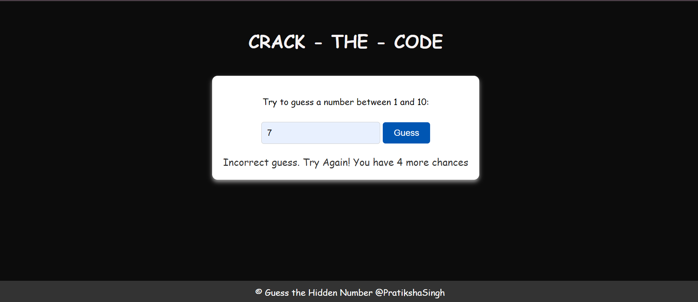

# crack-the-code
 It is a simple JavaScript guessing game where players have to guess the hidden number within 5 chances.

## How to Play

1. The computer will randomly select a number between 1 and 10.
2. You have 5 chances to guess the hidden number.
3. Enter your guess in the input field and click the "Guess" button.
4. After each guess, the game will provide feedback on whether your guess correct or not and provide you your remaining chances.
5. Keep guessing until you find the hidden number or run out of chances.

## Technologies Used

- HTML5
- CSS3
- JavaScript

## Acknowledgments

Special thanks to @KG-Coding-by-Prashant-Sir for inspiration.

